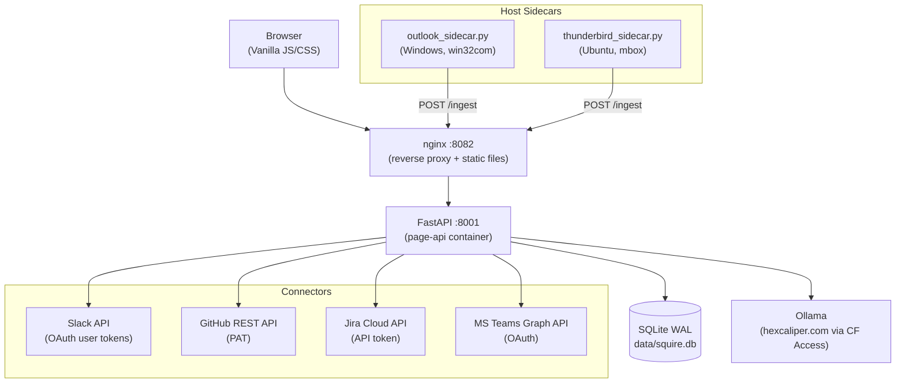
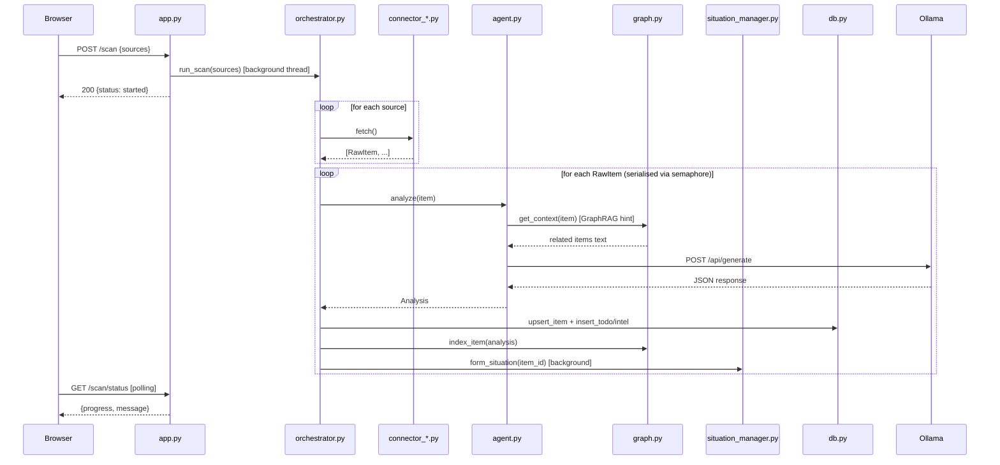
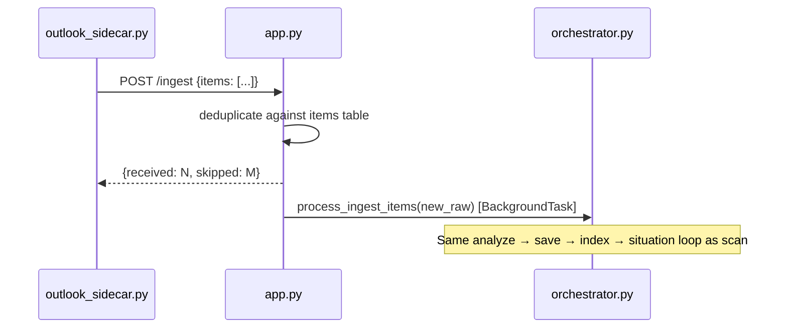
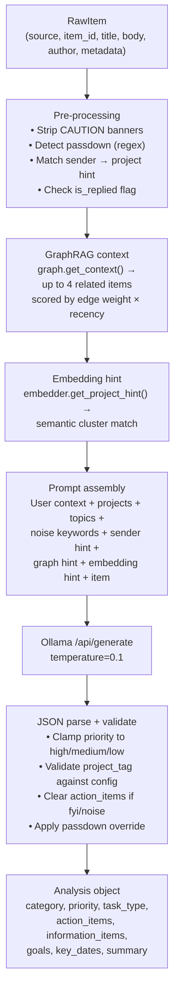
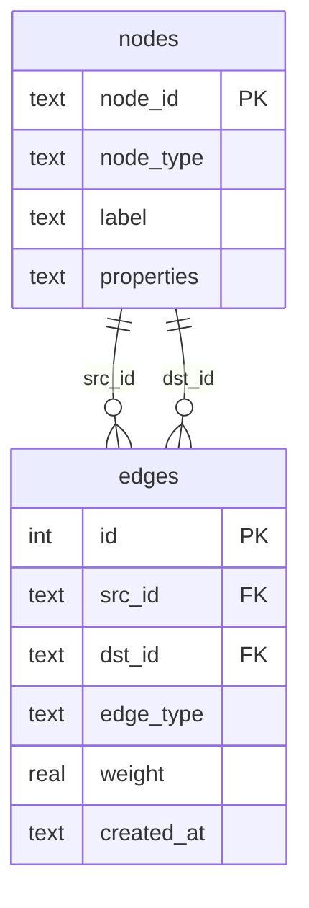
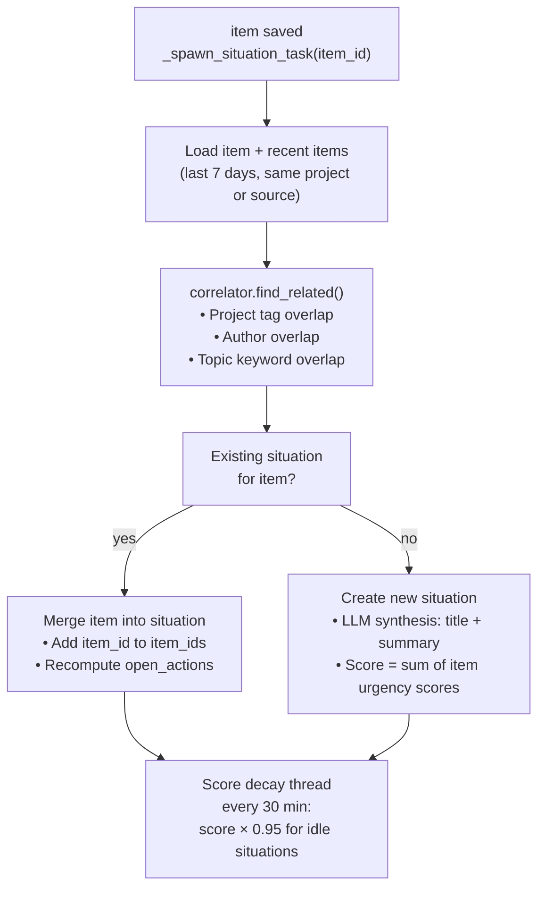
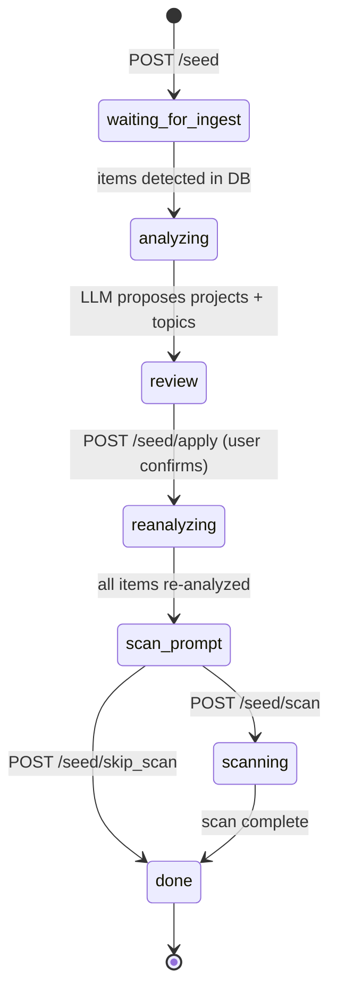
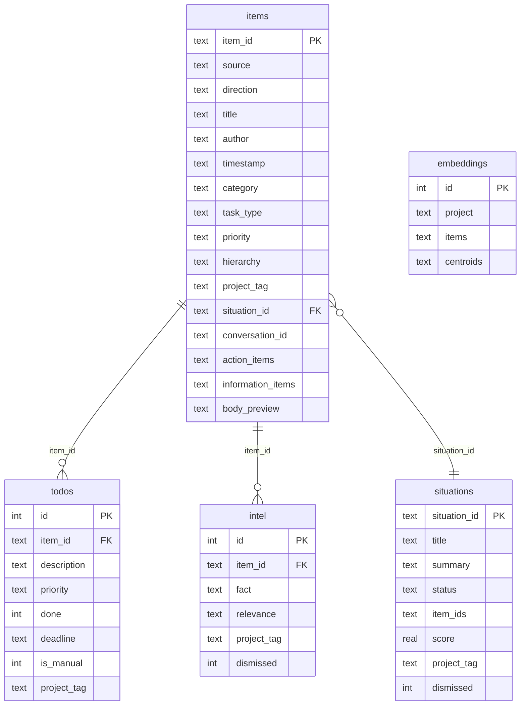
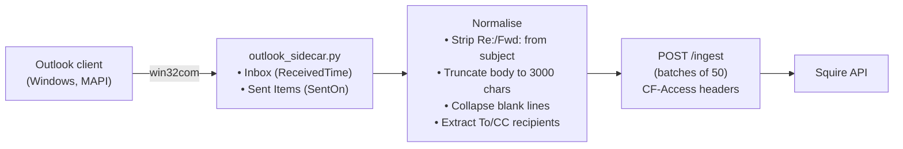
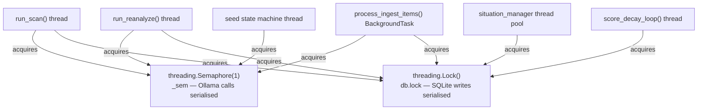

# Hexcaliper Squire — Software Design Document

## 1. Purpose

Squire is a personal ops intelligence layer that sits alongside Hexcaliper. It ingests items from Outlook, Slack, GitHub, Jira, and Microsoft Teams, runs each through a local LLM, and presents a unified action dashboard. No data leaves your infrastructure.

---

## 2. System Architecture



The API container is the single source of truth. nginx proxies all `/page/api/*` requests to it and serves the static frontend from `/page/`.

---

## 3. Module Map

| Module | Responsibility |
|--------|---------------|
| `app.py` | FastAPI routes, HTTP layer, background task dispatch, project/noise learning |
| `orchestrator.py` | Scan, re-analysis, and ingest pipeline execution; Ollama concurrency semaphore |
| `agent.py` | Prompt construction, Ollama call, JSON response parsing → `Analysis` |
| `db.py` | SQLite schema, connection management, all CRUD helpers |
| `graph.py` | Knowledge graph CRUD, context retrieval, GraphRAG scoring |
| `situation_manager.py` | Cross-source situation formation, LLM synthesis, score decay |
| `embedder.py` | Sentence-embedding centroids per project (all-MiniLM-L6-v2) |
| `correlator.py` | Heuristic item-to-situation matching (project, topic, author overlap) |
| `seeder.py` | Seed state machine (ingest → LLM proposal → review → apply → reanalyze) |
| `models.py` | Pydantic models: `RawItem`, `Analysis`, `ActionItem` |
| `config.py` | Environment variable loading and hot-reload helpers |
| `connector_*.py` | Source-specific fetch logic (one per connector) |

---

## 4. Data Flow

### 4.1 Scan pipeline (frontend-triggered)



### 4.2 Ingest pipeline (sidecar-triggered)



---

## 5. LLM Analysis Pipeline



### 5.1 Category schema

| Category | `task_type` | Meaning |
|----------|-------------|---------|
| `task` | `reply` | Compose and send a reply |
| `task` | `review` | Read/review a document, PR, or ticket |
| `task` | `null` | General action not fitting either sub-type |
| `approval` | — | Needs explicit sign-off from the user |
| `fyi` | — | Informational; no action required |
| `noise` | — | Irrelevant; suppressed from main view |

### 5.2 Hierarchy tiers

| Tier | Meaning |
|------|---------|
| `user` | Directly addressed — name/email in To/CC, @mention, assignment |
| `project` | Related to an active project but not directly addressed |
| `topic` | Matches a watch topic from `FOCUS_TOPICS` |
| `general` | Everything else |

---

## 6. Knowledge Graph

### 6.1 Structure



Node types: `item`, `person`, `project`, `conversation`

### 6.2 Edge types and weights

| Edge type | Weight | Created when |
|-----------|--------|--------------|
| `in_conversation` | 1.00 | Two Outlook items share a `ConversationID` |
| `in_situation` | 0.80 | Two items grouped into the same situation |
| `tagged_to` | 0.55 | Item tagged to a named project |
| `authored_by` | 0.40 | Item sent by the same person |

### 6.3 GraphRAG scoring

Each candidate related item is scored:

```
score = edge_weight × exp(−age_days × ln(2) / 14)
```

Half-life is 14 days. The top-N items (default 4) are formatted as a context block and injected into the LLM prompt for the current item. This lets the model reason about conversation threads and project workstreams across sources without re-scanning all history.

---

## 7. Situation Layer



Situations group related items across sources into a single tracked event (e.g. "Platform Migration incident" pulling together Slack threads, GitHub PRs, and Jira tickets).

---

## 8. Seed Workflow State Machine



The seed workflow bootstraps Squire when first deployed or after adding new projects. It runs a map-reduce LLM pass over existing items to propose a project list, lets the user review and edit, then re-analyzes everything with the confirmed configuration.

---

## 9. Database Schema



---

## 10. Project Learning

When a user tags an item to a project (`POST /analyses/{item_id}/tag`), a background job:

1. Updates `project_tag` on the analysis record.
2. Calls the LLM to extract 5–10 characteristic keywords from the item.
3. Merges keywords into `project.learned_keywords` (capped at 100).
4. Extracts all email addresses from From/To/CC fields.
5. Merges addresses into `project.learned_senders` (capped at 50, excluding the user's own address).
6. Saves updated settings and hot-reloads config.

On the next scan, learned keywords appear in the LLM prompt and in Slack/Teams pre-filters. Learned senders trigger deterministic pre-tagging before the LLM runs.

---

## 11. Noise Learning

When a user marks an item as noise (`POST /analyses/{item_id}/noise`), a background job:

1. Sets `category="noise"`, `priority="low"`, `has_action=false`.
2. Extracts keywords via LLM.
3. Merges into `config.NOISE_KEYWORDS` (capped at 200).

On subsequent scans, items matching only noise keywords are silently skipped or pre-labelled by the LLM.

---

## 12. Outlook Sidecar



The sidecar fetches both Inbox and Sent Items, tagging each with `direction: received|sent` and `conversation_id`/`conversation_topic` for graph threading. Cloudflare Access credentials are stored in Windows Credential Manager via `keyring`.

---

## 13. Concurrency Model



Only one Ollama call runs at a time. SQLite WAL mode allows concurrent reads while writes are serialised through `db.lock`. Scan/reanalyze/ingest respect a shared `scan_state["cancelled"]` flag and exit cleanly after their current item.
