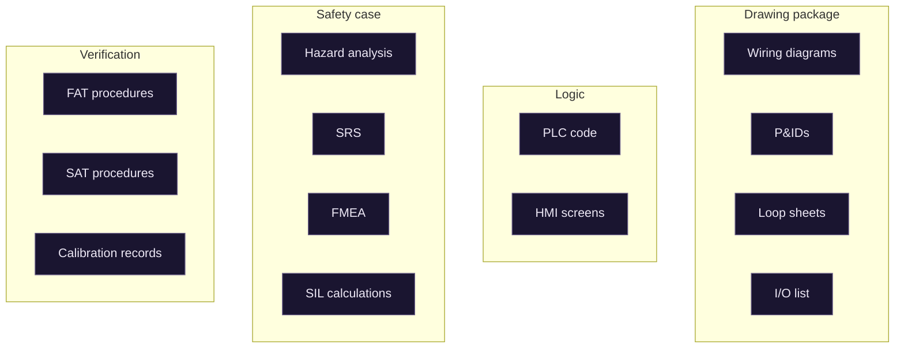
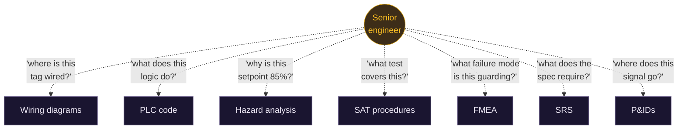
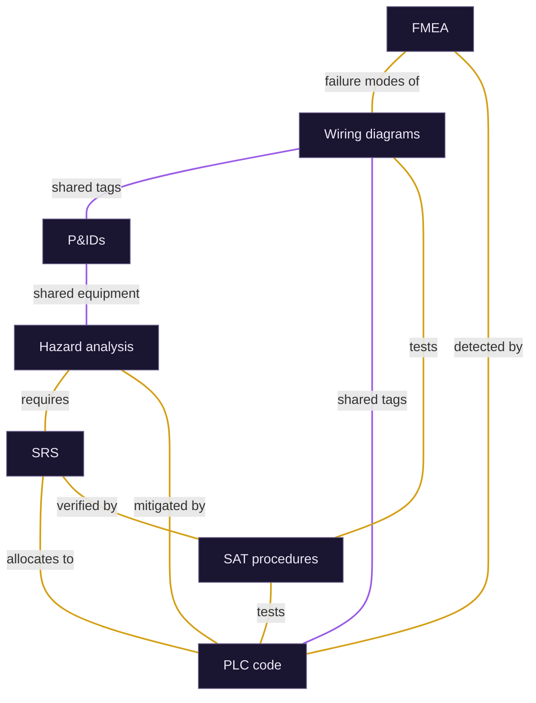
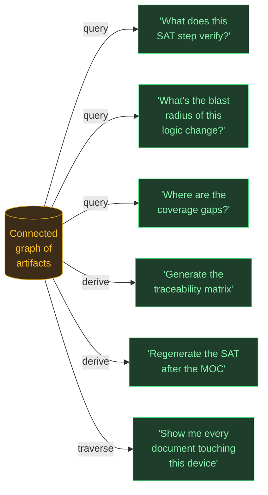

# Why a graph

A walk-through, in four pictures, of why the work products in industrial safety engineering naturally form a graph — and what that unlocks.

---

## 1. What you have today

Thirteen documents. Each one internally complete, formally reviewed, signed off. No connections drawn between them — because there's no document in the project where those connections live.

This is the reality. This is what gets handed over at the end of a project.

---

## 2. What you actually do with them

When something needs to happen — an MOC scoped, an incident investigated, a junior onboarded, a bid scoped — the engineer becomes a human index. They open document A, find a tag, switch to document B, find what reads it, switch to document C, find what tests it.

The connections are real. They're just not written down. They live between the engineer's ears, and they leave the company when the engineer does.

---

## 3. The connections, drawn

The same documents. The same connections the engineer was tracing in their head. Now visible.

This is a graph. Not because anyone designed it as one — because that's what the structure of the work *is*. The documents are nodes. The relationships between them are edges. We didn't impose a graph; we made the existing one visible.

The purple edges (shared tags, shared equipment) are mechanically derivable — same string appears in both documents. The gold edges (requires, allocates to, verified by, mitigates) are semantic — they describe meaning, not just co-occurrence. Both kinds are real. Both are traversed daily. Neither is written down.

---

## 4. What changes when the graph exists outside the engineer's head

Each of those questions is, today, a senior engineer with a stack of documents and several hours. Each one becomes a query when the graph is explicit.

None of these are AI tasks in the LLM sense. They're traversals. The graph does the work. The LLM, when it shows up at all, is at the edges — extracting structure from documents during ingestion, generating prose during rendering, helping a user phrase a query they don't quite know how to ask.

The valuable thing isn't a smarter document search. It's making the structure that already exists — in the engineer's head, in the work itself — explicit, queryable, auditable, and durable beyond any one engineer's tenure.

---

## The argument, compressed

The graph isn't a clever model imposed on engineering work. It's the honest representation of work that's already graph-shaped, currently encoded as a pile of documents and a senior engineer's memory. Making it explicit doesn't change the work — it changes who can do the work, how fast, and how reliably.
